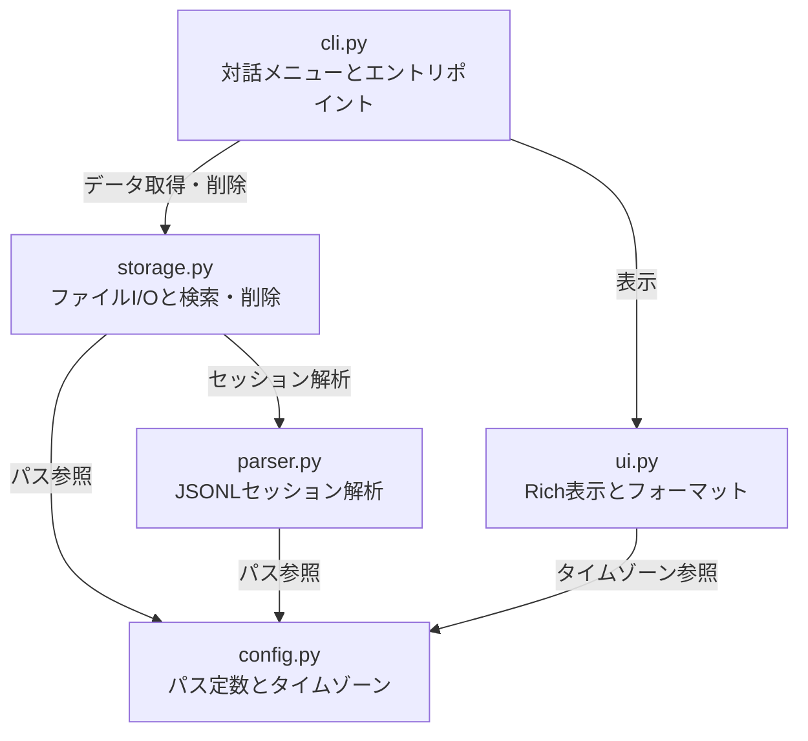

# claude-history-manager

Claude Codeが `~/.claude/` 以下に保存するセッションログ、入力履歴、プランファイルなどを一覧・検索・削除できるターミナルツールです。

## 概要

Claude Codeは会話のたびにJSONL形式のセッションログを `~/.claude/projects/` 以下に蓄積していきます。
長期間使い続けるとファイル数が数百を超え、合計サイズも数百MBに達することがあります。

このツールを使うと、すべてのセッションを日時・プロジェクト名・最初のメッセージとともに一覧表示し、不要なものを個別または一括で削除できます。
入力履歴(`history.jsonl`)やプランファイル(`plans/`)の管理にも対応しています。


## 管理対象

以下の `~/.claude/` 配下にあるデータを管理できます。

| 種類 | パス | 説明 |
|------|------|------|
| セッションログ | `projects/*/*.jsonl` | 各会話のJSONL形式ログファイルです |
| 入力履歴 | `history.jsonl` | CLIで入力したコマンドの履歴です |
| プランファイル | `plans/*.md` | Claude Codeが作成したプランのMarkdownファイルです |
| デバッグログ | `debug/` | デバッグ用のログファイルです |
| シェルスナップショット | `shell-snapshots/` | シェル状態のスナップショットです |
| ファイル履歴 | `file-history/` | ファイル編集のバックアップです |


## アーキテクチャ

このツールは5つのモジュールで構成されています。



各モジュールの役割は以下のとおりです。

### cli.py

アプリケーションのエントリポイントです。
対話式のメインメニューを提供し、セッション管理・入力履歴管理・プラン管理・検索・一括削除の各サブメニューを呼び出します。
コマンドライン引数を渡すことで対話モードを経由せずに直接結果を表示することもできます。

### storage.py

ファイルシステムとのやり取りを担当します。
セッション一覧の取得、入力履歴の読み込み、プランファイルの列挙、各種データの削除、キーワード検索、ストレージ使用量の集計を行います。

### parser.py

JSONLセッションファイルのパーサーです。
ファイルを1行ずつ読み込み、タイムスタンプ・ブランチ名・最初のユーザーメッセージ・アシスタント応答概要などのメタ情報を抽出します。
十分な情報が揃った時点で残りの行数だけをカウントし、読み込みを打ち切る早期終了の仕組みを備えています。

### ui.py

Richライブラリを使ったターミナル表示を担当します。
セッション一覧・詳細パネル・入力履歴テーブル・プラン一覧テーブル・ストレージ使用状況テーブルを描画します。

### config.py

パス定数(`CLAUDE_DIR`, `PROJECTS_DIR`, `HISTORY_FILE`, `PLANS_DIR`)とJSTタイムゾーンを定義しています。


## ディレクトリ構成

```
claude-history-manager/
  pyproject.toml
  claude_history_manager/
    __init__.py
    __main__.py
    cli.py
    config.py
    parser.py
    storage.py
    ui.py
  tests/
    __init__.py
    conftest.py
    test_cli.py
    test_parser.py
    test_storage.py
    test_ui.py
```


## セットアップ

Python 3.11以上とuvが必要です。

```bash
# リポジトリをクローンしたあと、依存パッケージをインストールします
uv sync

# 開発用の依存パッケージも含めてインストールします
uv sync --group dev
```


## 使い方

### 対話モードで起動する

引数なしで実行すると対話式のメインメニューが表示されます。

```bash
uv run claude-history
```

メニューでは番号を入力して操作を選びます。

```
╔══════════════════════════════════════╗
║        メインメニュー                ║
║                                      ║
║   1  セッション会話ログ一覧          ║
║   2  入力履歴 (history.jsonl)        ║
║   3  プランファイル                  ║
║   4  セッション検索                  ║
║   5  一括削除 (古いセッション)       ║
║   6  ストレージ使用状況              ║
║   q  終了                            ║
╚══════════════════════════════════════╝
```

### セッション一覧を表示する

セッションログの一覧を20件ずつページ送りで表示します。
各セッションの日時・プロジェクト名・ブランチ・メッセージ数・サイズと、最初のユーザーメッセージを確認できます。

番号を入力するとセッションの詳細が表示されます。
`d 番号` と入力するとそのセッションを削除できます。

### セッションを検索する

キーワードを入力すると、ユーザーメッセージ・アシスタント応答・プロジェクト名・ブランチ名・作業ディレクトリを横断的に検索します。
検索は大文字小文字を区別しません。

### 一括削除を実行する

以下の3つの条件で複数セッションをまとめて削除できます。

- 指定日より前のセッションを日付で絞り込んで削除します
- プロジェクト単位でまとめて削除します
- 指定サイズ以下の小さなセッションを削除します

いずれの場合も実行前に対象の一覧と合計サイズが表示され、確認を求められます。

### コマンドライン引数で直接実行する

対話モードを使わずにワンショットで結果を得ることもできます。

```bash
# セッション一覧を表示します
uv run claude-history sessions

# 入力履歴を表示します
uv run claude-history history

# ストレージ使用状況を表示します
uv run claude-history storage

# キーワードでセッションを検索します
uv run claude-history search MangaViewer
```


## 開発

### リンターを実行する

ruffでコードの静的解析とフォーマットチェックを行います。

```bash
# 静的解析を実行します
uv run ruff check .

# 問題があれば自動修正します
uv run ruff check --fix .

# フォーマットが揃っているか確認します
uv run ruff format --check .

# フォーマットを自動適用します
uv run ruff format .
```

ruffでは以下のルールセットを有効にしています。

| ルール | 内容 |
|--------|------|
| E, F, W | pyflakesとpycodestyleの基本ルールです |
| I | importの並び順を検査します |
| N | 命名規則を検査します |
| UP | Python 3.11向けの書き方に統一します |
| B | バグになりやすいパターンを検出します |
| A | 組み込み名の再定義を検出します |
| SIM | コードの簡略化が可能な箇所を検出します |
| TCH | 型チェック専用importの分離を検査します |

### 型チェックを実行する

mypyをstrictモードで実行します。

```bash
uv run mypy claude_history_manager/
```

### テストを実行する

pytestで全テストを実行します。カバレッジレポートが自動で出力されます。

```bash
# 全テストを実行します
uv run pytest

# 詳細な出力とともに実行します
uv run pytest -v

# 特定のテストファイルだけ実行します
uv run pytest tests/test_parser.py

# 特定のテストクラスだけ実行します
uv run pytest tests/test_cli.py::TestSessionMenu
```

### 全チェックをまとめて実行する

以下のコマンドで静的解析・フォーマット・型チェック・テストを一度に確認できます。

```bash
uv run ruff check . && uv run ruff format --check . && uv run mypy claude_history_manager/ && uv run pytest
```


## テスト構成

テストは4つのファイルに分かれています。

| ファイル | テスト数 | テスト対象 |
|----------|----------|------------|
| test_parser.py | 45 | JSONL解析、タイムスタンプ変換、メッセージ分類の単体テストです |
| test_storage.py | 37 | ファイルI/O、検索、削除の単体テストです |
| test_ui.py | 39 | 表示関数の出力キャプチャテストです |
| test_cli.py | 68 | 対話メニューのモックテストと結合テストです |

各テストファイルには正常系・異常系・境界値・エッジケースを含めています。
結合テストではセッションの取得から検索・削除までの一連のライフサイクルを検証しています。


## 動作環境

- Python 3.11以上が必要です
- macOSとLinuxで動作します
- uvによるパッケージ管理を前提としています


## ライセンス

MIT
